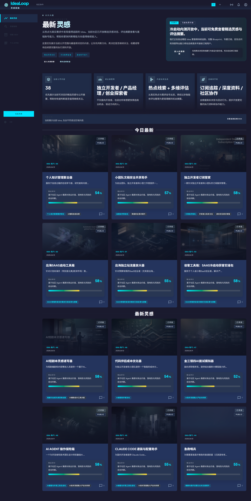
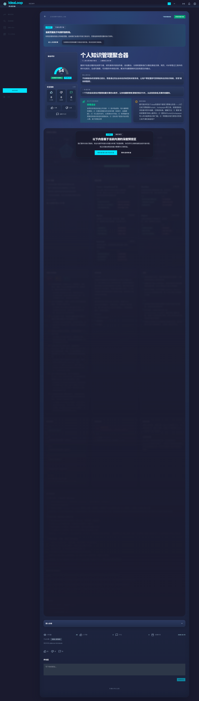
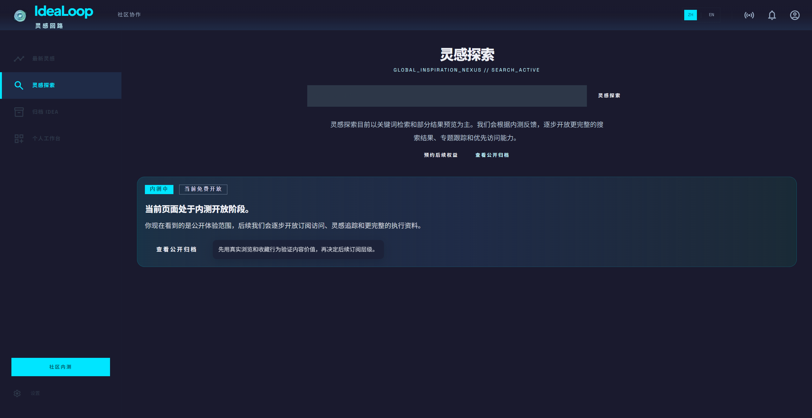

# IdeaLoop

> Idea 发现与机会判断平台. 帮你在 AI 时代更快发现值得做的方向.

网站: https://idealoop.top

## 产品截图

### 首页



### 灵感详情页



### 灵感探索页



IdeaLoop 是一个面向独立开发者, 产品经理, 创业者和副业探索者的 Idea 发现与机会判断平台.

它关注的不是「再做一个信息流」, 也不是一开始就包装成热闹的社区, 而是解决一个更具体的问题:

**在 AI 时代, 执行工具越来越便宜, 真正稀缺的是值得投入的 Idea 和判断能力.**

IdeaLoop 希望把分散在全网的热点信号, 用户讨论, 趋势变化和真实需求, 转化成更清晰, 更可判断, 更适合行动的机会线索.

## 我们想做什么

每天都有大量热点, 帖子, 评论, 产品发布和行业变化出现, 但其中大部分内容都停留在「看起来有意思」的层面.

IdeaLoop 想做的是:

- 发现值得关注的趋势和需求信号.
- 从噪音里筛出更有潜力的方向.
- 把零散信息整理成可理解的机会线索.
- 用多维度评估帮助用户判断「这件事值不值得继续投入」.
- 在用户量和内容密度起来后, 再逐步沉淀讨论, 共识和更完整的社区能力.

换句话说, 我们不只想帮助用户「看到热点」, 更想帮助用户「理解机会」.

## IdeaLoop 的核心体验

在 IdeaLoop 中, 一个灵感并不只是一个标题或一句判断.

它更像是一条逐步成形的机会链路:

```text
全网热点
   ↓
信号提取
   ↓
机会判断
   ↓
市场, 竞品, 风险和 MVP 评估
   ↓
用户浏览, 搜索, 收藏或提交自己的评估
   ↓
更好的下一轮 Idea 发现
```

这也是 `Loop` 这个名字的来源:

**热点进入系统, 经过筛选, 理解, 评估和反馈后, 再回流为新的高质量认知.**

## 为什么是现在

AI 正在极大降低「做出来」的门槛, 但「做什么」依然是最难的问题.

很多人并不缺执行工具, 缺的是:

- 更早发现机会的能力.
- 更快验证方向的能力.
- 更低成本做判断的能力.
- 从热点和讨论中提炼真实需求的能力.

IdeaLoop 试图把这些能力组织成一个可持续进化的产品.

## 适合谁

IdeaLoop 主要面向这些人:

- 独立开发者.
- 产品经理.
- 内容创业者.
- 小团队创业者.
- 副业探索者.
- 对商业机会, 趋势判断和项目方向感兴趣的人.

如果你经常会问这些问题, 那么你大概率会喜欢这个项目:

- 最近有什么值得关注的机会?
- 哪些热点只是噪音, 哪些可能真的有价值?
- 某个方向是否值得投入时间?
- 这个想法背后的用户需求到底是什么?
- 市场上有没有成熟竞品, 还有没有差异化空间?

## 当前阶段

IdeaLoop 当前仍处于冷启动和持续建设阶段.

现阶段更适合把它理解为:

- 一个精选 Idea 发现入口.
- 一个机会判断和评估摘要平台.
- 一个可以提交自己想法做初步评估的工作台.
- 一个未来可能逐步生长出讨论, 共识和协作能力的产品.

因此, 我们现在不会把 IdeaLoop 过度包装成成熟社区. 社区讨论, 共识沉淀, 声誉体系和更完整的 Blueprint 会在 DAU, 内容密度和用户反馈稳定后逐步开放.

## 这个仓库目前是什么

这是 IdeaLoop 的公开入口仓库.

当前阶段, 它主要承担这些作用:

- 对外介绍 IdeaLoop 的产品定位与愿景.
- 作为 GitHub 上的品牌展示页.
- 为后续开源协作预留入口.
- 帮助开发者和潜在用户快速理解项目方向.

这意味着它现在不是完整源码仓库, 也不是部署仓库.

## 后续会逐步开放的内容

随着项目推进, 我们计划逐步开放更多适合协作的部分, 例如:

- 数据接入规范与抓取插件生态.
- 面向开发者的公开文档.
- 社区前端中的部分通用界面能力.
- 部分基础能力和公共约定.

我们会谨慎处理开源边界, 因为 IdeaLoop 的核心价值不仅在代码, 更在持续积累的数据反馈, 评估质量和认知沉淀.

## 项目原则

我们相信:

- 代码不是唯一壁垒.
- 数据反馈会形成飞轮.
- 好的方向判断能显著降低无效试错.
- 高质量机会分析比低质量流量更重要.
- 一个好产品应该帮助人更快做出判断, 而不只是制造更多信息.

## 关注项目

如果你对以下方向感兴趣, 欢迎关注这个仓库:

- AI + 商业机会发现.
- 趋势信号提取.
- 创业灵感系统.
- 独立开发方向判断.
- 开放协作与产品共建.

未来这里会继续更新.
